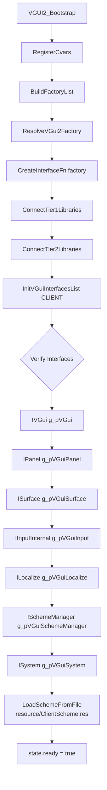
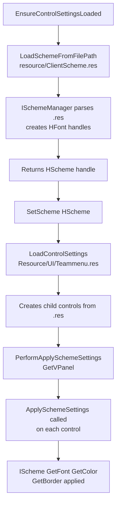
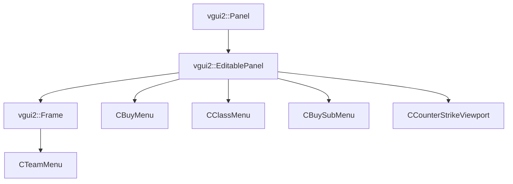
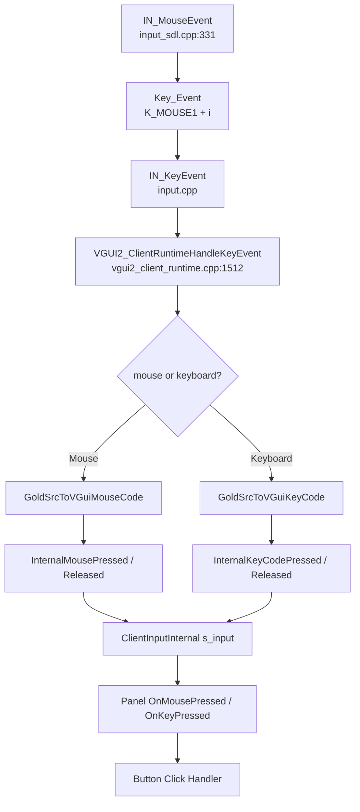
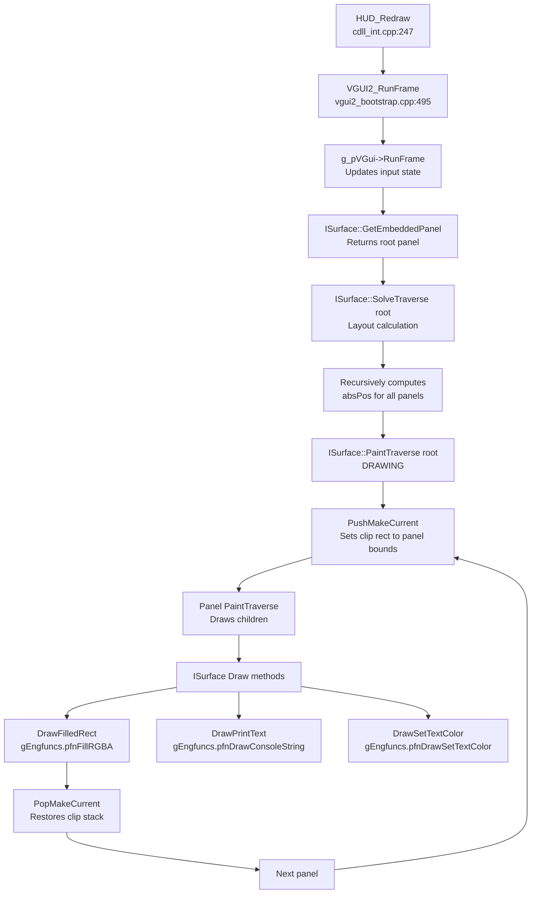
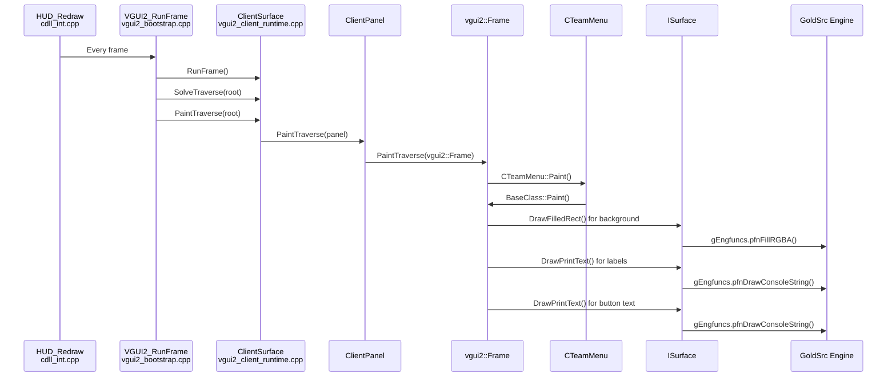
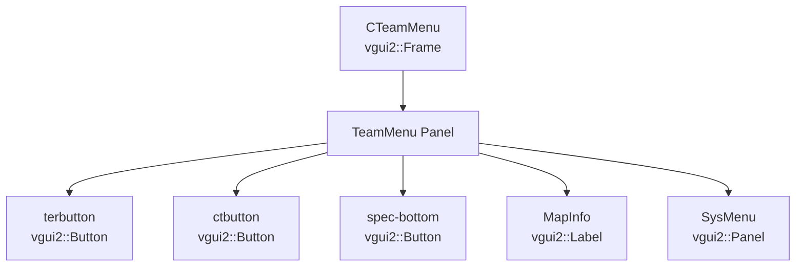
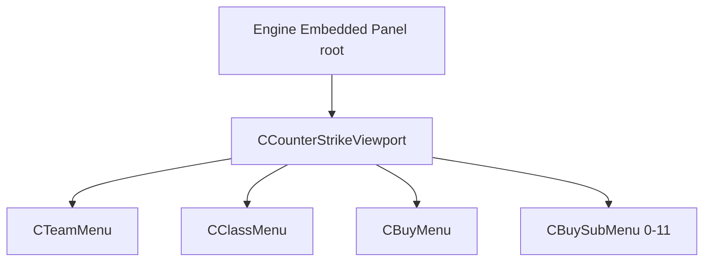
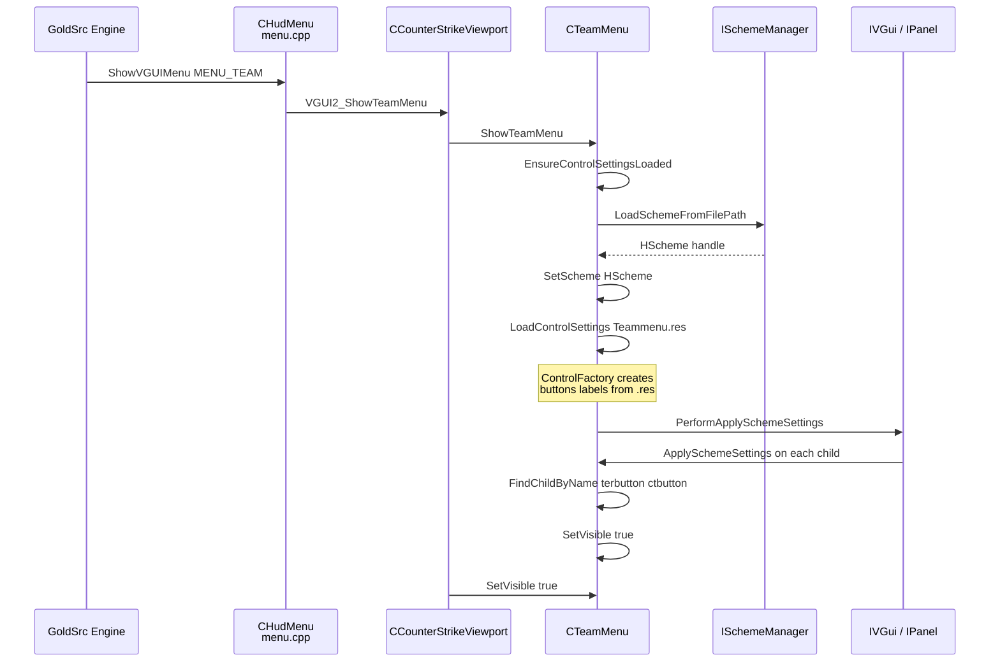

# VGUI2 System Architecture

## Overview

This document describes the VGUI2 system integration in the CS16 client, which bridges Valve's Source SDK VGUI2 panel system with the GoldSrc (HL1) engine. It enables Source-style in-game menus, HUD elements, and UI panels to render within the classic Half-Life engine.

---

## 1. Bootstrap System

### Entry Point

`VGUI2_Bootstrap()` (`vgui2_bootstrap.cpp:256`) is the main initialization function called from `HUD_Initialize()` (`cdll_int.cpp:67-72`).

### Factory Resolution

Before interfaces can be queried, the system must resolve the `CreateInterfaceFn` factory from the engine:

```cpp
ResolveVGui2Factory()  // vgui2_bootstrap.cpp:115-204
```

**Platform-specific resolution:**

| Platform | Method |
|----------|--------|
| Windows | `GetModuleHandleA("xash3d"\|"xash3d-fwgs"\|"hw"\|"sw")` → `GetProcAddress("VGui2_GetFactory")` |
| macOS | `dlopen(NULL)` → `dlsym("VGui2_GetFactory")` |
| Linux | `dlopen(NULL)` → `dlsym("VGui2_GetFactory")` |
| Emscripten | Direct engine import via `VGui2_GetFactory()` |

### Bootstrap Sequence



---

## 2. .res File Loading Pipeline

### 2.1 VDF (Valve Data Format) Parsing

.res files are VDF-formatted (Valve Data Format). The client includes a VDF parser at `third_party/ValveFileVDF/vdf_parser.hpp`.

**VDF to KeyValues conversion** (`cstriketeammenu.cpp:50-97`):
```cpp
KeyValues *ConvertVdfNodeToKeyValues(const tyti::vdf::multikey_object &node)
{
    KeyValues *kv = new KeyValues(node.name.c_str());
    for (const auto &attrib : node.attribs)
        kv->SetString(attrib.first.c_str(), attrib.second.c_str());
    for (const auto &childEntry : node.childs)
        kv->AddSubKey(ConvertVdfNodeToKeyValues(*childEntry.second));
    return kv;
}
```

### 2.2 .res File Structure

Example `Resource/UI/Teammenu.res`:
```
"TeamMenu"
{
    "ControlName" "Frame"
    "xpos" "0"
    "ypos" "0"
    "wide" "640"
    "tall" "480"

    "terbutton"
    {
        "ControlName" "Button"
        "labelText" "Terrorist"
        "xpos" "50"
        "ypos" "100"
    }

    "ctbutton"
    {
        "ControlName" "Button"
        "labelText" "Counter-Terrorist"
        "xpos" "350"
        "ypos" "100"
    }
}
```

### 2.3 LoadControlSettings Flow

```mermaid
flowchart TD
    A[LoadControlSettings<br/>Resource/UI/Teammenu.res] --> B[FileSystem reads .res file]
    B --> C[VDF Parser converts to KeyValues]
    C --> D[For each child node in KeyValues]
    D --> E[Read ControlName property<br/>e.g., "Button", "Label", "Frame"]
    E --> F[ControlFactory creates C++ object]
    F --> G[Read position/size properties<br/>xpos, ypos, wide, tall]
    G --> H[Apply properties via setters<br/>SetPos, SetSize, SetVisible]
    H --> I[Add child to parent panel]
    I --> D
    D --> J[Call PerformApplySchemeSettings]
    J --> K[Trigger ApplySchemeSettings<br/>on each control]
    K --> L[Scheme fonts/colors/borders<br/>applied to controls]
```

---

## 3. Scheme Loading and Application

### 3.1 ClientScheme.res Structure

```cpp
"Scheme"
{
    "Fonts"
    {
        "MainLabel" { "font" "Arial" "size" "16" }
        "ButtonText" { "font" "Verdana" "size" "14" }
    }
    "Colors"
    {
        "TanDark" "255 160 100 255"
        "ButtonBg" "80 80 80 255"
    }
    "Borders"
    {
        "ButtonBorder" { ... }
    }
}
```

### 3.2 Scheme Loading Flow



### 3.3 ISchemeManager Interface

| Method | Purpose |
|--------|---------|
| `LoadSchemeFromFilePath()` | Parse .res, create fonts/colors/borders, return `HScheme` |
| `GetIScheme(HScheme)` | Get `IScheme*` from handle for querying |
| `GetFont(const char*, bool)` | Retrieve `HFont` by name |
| `GetColor(const char*, Color)` | Retrieve color by name |
| `GetBorder(const char*)` | Retrieve border by name |

---

## 4. Panel Styling Flow

### 4.1 ApplySchemeSettings Pattern

All menu panels override `ApplySchemeSettings()` to apply scheme-derived styling:

```cpp
void CTeamMenu::ApplySchemeSettings(vgui2::IScheme *scheme)
{
    BaseClass::ApplySchemeSettings(scheme);  // Parent applies scheme first
    SetPaintBackgroundEnabled(true);
    // Query scheme for fonts/colors:
    // HFont font = scheme->GetFont("ButtonText");
    // Color bg = scheme->GetColor("ButtonBg", Color(0,0,0,255));
}
```

### 4.2 Class Hierarchy



### 4.3 Control Creation in Menus

**CTeamMenu** (`cstriketeammenu.cpp:199-213`):
```cpp
void CTeamMenu::EnsureControlSettingsLoaded()
{
    // Load scheme
    clientScheme = vgui2::scheme()->LoadSchemeFromFilePath(...);
    SetScheme(clientScheme);

    // Load .res - creates all buttons/labels
    BaseClass::LoadControlSettings("Resource/UI/Teammenu.res");

    // Find loaded controls by name
    FindChildByName("terbutton");    // Terrorist button
    FindChildByName("ctbutton");      // CT button
    FindChildByName("spec-bottom");   // Spectate button
}
```

---

## 5. Input Handling Pipeline



### Input Key Code Translation

| GoldSrc Key | VGUI2 KeyCode |
|-------------|---------------|
| `K_MOUSE1` | `MOUSE_LEFT` |
| `K_MOUSE2` | `MOUSE_RIGHT` |
| `K_ESCAPE` | `KEY_ESCAPE` |
| `K_TAB` | `KEY_TAB` |
| `K_ENTER` | `KEY_ENTER` |

---

## 6. Rendering Pipeline

### 6.1 Per-Frame Rendering Flow



### 6.2 ISurface Drawing Bridge

`ClientSurface` (`vgui2_client_runtime.cpp:1101`) delegates to GoldSrc via `gEngfuncs`:

| ISurface Method | GoldSrc Function |
|----------------|------------------|
| `DrawFilledRect()` | `gEngfuncs.pfnFillRGBA()` |
| `DrawPrintText()` | `gEngfuncs.pfnDrawConsoleString()` |
| `DrawSetTextColor()` | `gEngfuncs.pfnDrawSetTextColor()` |
| `DrawLine()` | `DrawFilledRect()` (single-pixel) |
| `DrawOutlinedRect()` | 4× `DrawFilledRect()` |

### 6.3 Complete Rendering Chain

```
HUD_Redraw()
    └── VGUI2_RunFrame()
            ├── g_pVGui->RunFrame()
            │       └── UpdateMouseFocus()
            │
            ├── ISurface::GetEmbeddedPanel() → root
            │
            ├── SolveTraverse(root)
            │       └── ClientPanel::Solve() → absPos = parent.absPos + offset
            │
            └── PaintTraverse(root)
                    └── ClientPanel::PaintTraverse()
                            └── vgui2::Frame::PaintTraverse()
                                    ├── Paint background (DrawFilledRect)
                                    └── For each child:
                                            ├── PushMakeCurrent(clip to bounds)
                                            ├── Child::Paint() → ISurface calls
                                            └── PopMakeCurrent()
```

---

## 7. CTeamMenu Complete Rendering Path

### 7.1 Sequence Diagram



### 7.2 Control Hierarchy in CTeamMenu



### 7.3 Key Files for CTeamMenu

| File | Line | Purpose |
|------|------|---------|
| `cstriketeammenu.cpp` | 123-153 | Constructor |
| `cstriketeammenu.cpp` | 155-217 | EnsureControlSettingsLoaded |
| `cstriketeammenu.cpp` | 219-225 | ApplySchemeSettings |
| `cstriketeammenu.cpp` | 227-234 | Paint() |
| `counterstrikeviewport.cpp` | 125-153 | ShowTeamMenu |
| `vgui2_bootstrap.cpp` | 495-511 | VGUI2_RunFrame |
| `vgui2_client_runtime.cpp` | 1147-1151 | DrawFilledRect |
| `vgui2_client_runtime.cpp` | 1202-1217 | DrawPrintText |

---

## 8. Interface Architecture

### Global Interface Pointers

All interfaces are declared in `vgui2_stub_types.h` and mapped via macros:

| Interface | Global Pointer | Role |
|-----------|---------------|------|
| **IVGui** | `g_pVGui` | Core - RunFrame, panel alloc/free |
| **IPanel** | `g_pVGuiPanel` | Hierarchy - parent/child, visibility |
| **ISurface** | `g_pVGuiSurface` | Rendering - primitives, text |
| **IInputInternal** | `g_pVGuiInput` | Input - focus, cursor |
| **ILocalize** | `g_pVGuiLocalize` | String localization |
| **ISchemeManager** | `g_pVGuiSchemeManager` | Theming - fonts, colors |
| **ISystem** | `g_pVGuiSystem` | System - cursors, clipboard |

---

## 9. Viewport System

### Panel Hierarchy



### Menu Routing

| GoldSrc Menu | VGUI2 Function |
|-------------|----------------|
| `MENU_TEAM` | `VGUI2_ShowTeamMenu()` |
| `MENU_CLASS_T/CT` | `VGUI2_ShowClassMenu()` |
| `MENU_BUY` | `VGUI2_ShowBuyMenu()` |
| `MENU_BUY_*` | `VGUI2_ShowBuySubMenu()` |

---

## 10. Client Runtime Mode

When `VGUI2_ClientRuntimeInstall()` is called, in-client implementations override engine interfaces:

```cpp
static ClientVGui s_vgui;           // IVGui
static ClientPanel s_panel;         // IPanel
static ClientInputInternal s_input; // IInputInternal
static ClientSurface s_surface;     // ISurface

g_pVGui = &s_vgui;
g_pVGuiPanel = &s_panel;
g_pVGuiSurface = &s_surface;
g_pVGuiInput = &s_input;
```

Uses GoldSrc `gEngfuncs` for all drawing, bypassing engine VGUI.

---

## 11. Stub Mode

When `VGUI2_STUB_MODE` is defined, all operations are no-ops:

| Function | Behavior |
|----------|----------|
| `ConnectTier1Libraries()` | Returns `true` |
| `ConnectTier2Libraries()` | Returns `true` |
| `VGui_InitInterfacesList()` | Returns `true` |
| All interface pointers | `NULL` |

---

## 12. Full Lifecycle

```mermaid
flowchart TD
    subgraph Initialization["INITIALIZATION PHASE"]
        A1[HUD_Initialize] --> B1[VGUI2_Bootstrap]
        B1 --> C1[ResolveVGui2Factory]
        C1 --> D1[ConnectTier1Libraries]
        D1 --> E1[ConnectTier2Libraries]
        E1 --> F1[InitVGuiInterfacesList]
        F1 --> G1[Verify IVGui IPanel ISurface<br/>IInputInternal ISchemeManager ISystem]
        G1 --> H1[LoadSchemeFromFilePath<br/>resource/ClientScheme.res]
        H1 --> I1[state.ready = true]
    end

    subgraph VideoInit["VIDEO INIT PHASE"]
        A2[HUD_VidInit] --> B2[VGUI2_Bootstrap<br/>if not ready]
        B2 --> B3[VGUI2_OnVidInit]
        B3 --> C2[VGUI2_CreateViewport]
        C2 --> D2[new CCounterStrikeViewport root]
        D2 --> E2[CreatePanels]
        E2 --> F2[m_pTeamMenu = new CTeamMenu]
        E2 --> F2a[m_pClassMenu = new CClassMenu]
        E2 --> F2b[m_pBuyMenu = new CBuyMenu]
    end

    subgraph MenuShow["MENU SHOW PHASE"]
        A3[ShowVGUIMenu<br/>menu.cpp:316] --> B4[VGUI2_ShowTeamMenu]
        B4 --> C3[EnsureControlSettingsLoaded]
        C3 --> D3[LoadSchemeFromFilePath]
        D3 --> E3[SetScheme clientScheme]
        E3 --> F3[LoadControlSettings<br/>Resource/UI/Teammenu.res]
        F3 --> G3[PerformApplySchemeSettings]
        G3 --> H3[FindChildByName<br/>terbutton ctbutton]
        H3 --> I3[SetVisible true]
    end

    subgraph Render["RENDER LOOP - EVERY FRAME"]
        A4[HUD_Redraw] --> B5[VGUI2_RunFrame]
        B5 --> C4[g_pVGui->RunFrame]
        C4 --> D4[UpdateMouseFocus]
        D4 --> E4[SolveTraverse root]
        E4 --> F4[PaintTraverse root]
        F4 --> G4[PushMakeCurrent<br/>Set clip to panel bounds]
        G4 --> H4[Panel PaintTraverse]
        H4 --> I4[Draw methods: FillRect<br/>PrintText Line OutlinedRect]
        I4 --> J4[gEngfuncs.pfnFillRGBA<br/>pfnDrawConsoleString]
        J4 --> K4[PopMakeCurrent]
        K4 --> L4{Next panel?}
        L4 -->|Yes| G4
        L4 -->|No| M1[Frame complete]
    end

    subgraph Shutdown["SHUTDOWN PHASE"]
        A5[HUD_Shutdown] --> B6[VGUI2_OnShutdown]
        B6 --> C5[VGUI2_DestroyViewport]
        C5 --> D5[delete g_pCounterStrikeViewport]
        D5 --> E5[VGUI2_DestroyTestPanel]
    end
```



### Menu Activation Lifecycle



---

## 13. CVar Controls

| CVar | Default | Purpose |
|------|---------|---------|
| `cl_vgui2_bootstrap` | `1` | Enable/disable VGUI2 bootstrap |
| `cl_vgui2_testpanel` | `1` | Show test panel |
| `cl_vgui2_menus` | `1` | Enable VGUI2 menus |
| `cl_vgui2_debugpaint` | `0` | Paint debug |

---

## 14. Key Files Reference

| File | Purpose |
|------|---------|
| `cl_dll/vgui2_bootstrap.cpp` | Factory resolution, bootstrap |
| `cl_dll/vgui2_client_runtime.cpp` | Client VGUI implementations |
| `cl_dll/VGUI/cstriketeammenu.cpp` | Team menu panel |
| `cl_dll/VGUI/counterstrikeviewport.cpp` | Main viewport |
| `cl_dll/cdll_int.cpp` | Client DLL entry points |
| `cl_dll/input.cpp` | Key event routing |
| `third_party/ValveFileVDF/vdf_parser.hpp` | VDF parsing |
| `hl1_source_sdk/public/vgui/IScheme.h` | Scheme interfaces |
| `hl1_source_sdk/public/vgui_controls/Panel.h` | Base panel class |
| `hl1_source_sdk/public/vgui_controls/BuildGroup.h` | LoadControlSettings |
